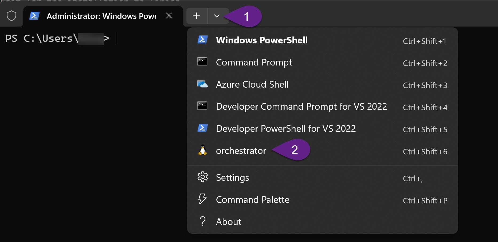

# WEO - WSL Environment Orchestrator
## Prepare WSL
In order to use Zephyr in WSL we first have to install WSL. For this do the following steps:
1. Open a Terminal
2. Install wsl with ubuntu with this command: `wsl --install --distribution Ubuntu`
3. Wait for the installation to finish
4. Start the ubuntu instance by clicking on start, searching for `Ubuntu` and starting it.

    

5. You will be asked to provide a username and a password. In this tutorial we choose `development` for both.
6. Add the default user to the wsl config by running this command: `sudo sh -c 'echo "\n[user]\ndefault=development" >> /etc/wsl.conf'`
7. Update the distro: `sudo apt update && sudo apt dist-upgrade -y`
8. Create a ssh key for inter-instance-communication: `ssh-keygen -q -t ed25519 -C "development" -N '' <<< ~/.ssh/id_ed25519`
9. Add the ssh-key to the authorized keys: `cat ~/.ssh/id_ed25519.pub >> ~/.ssh/authorized_keys`
10. Make sure the permissions on the file are correct: `chmod 700 ~/.ssh && chmod 600 ~/.ssh/authorized_keys`
11. Install ssh server: `sudo apt-get install openssh-server -y`
12. Enable ssh server: `sudo systemctl enable ssh`
13. Harden ssh config: `sudo sh -c 'echo "ChallengeResponseAuthentication no\nPasswordAuthentication no\nUsePAM no\nPermitRootLogin no\n" >> /etc/ssh/sshd_config.d/disable_root_login.conf'`
14. Close the ubuntu instance
15. Open a new terminal and shutdown wsl: `wsl --shutdown`
16. Create a base image for all future WSL instances by using the following command:
`wsl --export Ubuntu <TEMPLATE_DIR>/ubuntu.tar`. Replace `<TEMPLATE_DIR>` with the directory where you want to store WSL templates e.g. `wsl --export Ubuntu $HOME/wsl/ubuntu.tar`.
17. Remove the ubuntu distribution as it is no longer used: `wsl --unregister Ubuntu`
18. Additionally also uninstall the `Ubuntu` program from the installed software in Windows.

## Prepare Ansible Machine
Before we can setup new Zephyr development environments we have to create a management instance which will then be used to bootstrap new development environments.

1. Create a new wsl instance by importing your base image: `wsl --import orchestrator  <INSTANCE_DIR> <TEMPLATE_DIR>/ubuntu.tar`. Replace `<TEMPLATE_DIR>` with the directory where your wsl templates are stored and `<INSTANCE_DIR>` with the directory where the wsl files of this instance should be stored e.g. `wsl --import orchestrator $HOME/wsl/orchestrator $HOME/wsl/ubuntu.tar`.
2. Reopen the windows terminal. You should now see the orchestrator in the list of possible tabs:
    
    

3. Start the instance `orchestrator`. This might take a little while since it is the first start.
4. Install python: `sudo apt install python3 python3-pip -y`
5. Install ansible: `python3 -m pip install --user ansible`
6. Add ansible to path: `echo "export PATH=\$PATH:\$HOME/.local/bin" >> $HOME/.bashrc`
7. Reopen the `orchestrator` instance.

Now the orchestrator is ready to do it's work. Now the environments can be setup. For this refer to the respective `README` in the environment folder.

## Prepare the Environment machine
1. Import a new machine `wsl --import <ENVIRONMENT_NAME> <INSTANCE_DIR> <TEMPLATE_DIR>/ubuntu.tar`. Replace `<ENVIRONMENT_NAME>` with the name of the environment you want to create, `<TEMPLATE_DIR>` with the directory where your wsl templates are stored and `<INSTANCE_DIR>` with the directory where the wsl files of this instance should be stored e.g. `wsl --import zephyr $HOME/wsl/zephyr $HOME/wsl/ubuntu.tar`
